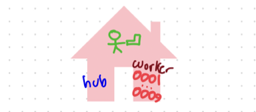
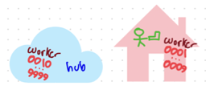

### FAQ
How do I download renders?
- running ***bridgeoomerfarm.sh*** connects to your private oomerfarm network. Then mount the hub like any other network folder.
    -  Microsoft Explorer 
        - **//hub.oomer.org/oomerfarm/renders**  (win)
    -  MacOS Finder ( Connect to Server ) 
        - **smb://hub.oomer.org/oomerfarm/renders** network  folder (**smb/cifs**) using drag&drop in Explorer/Finder 

>Is oomerfarm useful for a lone artist?
- Yes, renting cloud computers by the hour is less capital cost intensive than buying another computer just to do renders. I am currently tracking a benchmark scene that renders for $0.04/frame using a rented cloud computer and $0.005-$0.01/frame in electrical costs using on-premise hardware based on similar cpu resources.  Renderfarm queues are also a better way to keep track of rendering different looks.

>Is oomerfarm useful for a team of artists?
- Yes, within the oomerfarm private network, any artists can submit jobs to the renderfarm to share resources across multiple locations including multiple on-premise workers. 

>Can I use oomerfarm without the cloud?
- Yes, grab a bunch of brand new Threadrippers or 10 year old Xeon's along with a single ebay computer acting as a hub, install Linux on all of them and plug in the ethernet cables and run the oomerfarm bash scripts.

>Can I use oomerfarm on the road with a laptop and cloud render workers?
- Yes, the VPN works anywhere you have internet access to connect fully to all parts of your renderfarm. I use it daily in my car.

>Can I use a mix of computers I own and the cloud and a laptop?
- Yes, blend existing hardware and add a rental computer with the bash scripts in minutes. Manually shut down rentals after downloading rendered images from the file server. For advanced animation users, who deploy dozens of spot instances on Google, AWS or Azure, **workers** can detect idle cpu time and automatically shut down in the middle of the night whenever the renderfarm job queue is empty.

> Can I use Windows or MacOS computers as the hub or as workers?
- No, while Deadline supports running on Windows , MacOS and Linux, oomerfarm limits  **workers** and **hub** to running Linux because it is already insanely complex.

>A renderfarm manager ( ie AWSThinkbox's Deadline ) marshalls job submissions, monitoring, errors, license tracking, job priorities, time sharing with others and a whole host of other value added features. 

- Even before launching a render manager, there is a complex weave of networking, security and dependencies that need fulfilling before the farm **just works**. Oomerfarm TRYS to wrangle these threads of complexity so that even AWS Thinkbox's Deadline ( typically used in large studios ) becomes useful for a single artist with 2-10 render workers.

[ Initially AWS Thinkbox Deadline will be the render manager but Sony's open source OpenCue could be an option in the future.]

### oomerfarm makes these scenarios easy ###

1. In the home

    

2. Road warrior spinning up cloud rentals as needed

    

3. Combining home computers with hourly rentals

    

    ### Requirements ###

**Cloud rental or in-house server**hub
- 1 server with 1+ cores
- Alma/Rocky Linux 8.x 

**Cloud Rentals**workers
- 1+ server(s) with LOTSATM cores
- Alma/Rocky Linux 8.x ( Ubuntu might work )

**Win/Mac/Linux**boss
- [ Deadline ]( https://awsthinkbox.com )
- [ git-bash ]( https://git-scm.com )win only

**Extra**
- Google account

## Tech breakdown:
-  a **hub** host running Alma/Rocky Linux 8.x, Samba, MongoDB and AWS Thinkbox's Deadline Repository in the cloud
- an enterprise grade built-in firewall overlay network https://github.com/slackhq/nebula ( open source with full certificate-authority infrastructure[ allowing you to skip third party CA's ] )
- Linux **worker** hosts for simultaneously rendering locally AND/OR in cloud. VPN IP address assignment is written to Nebula certs/keys by ***keyoomerfarm.sh***. Instead of a typical deploy new instance with a bespoke cert/key, ***oomerfarm*** adopts ***batch certification***, as I call it, meaning every worker stores ALL worker certs/keys and on boot dynamically chooses one. Thus any worker vm can be cloned via the cloud providers web panel or programmatically via cli tools.
- Because oomerfarm's bash scripts don't take very long to run, the network topology can be redefined by rerunning keyoomerfarm.sh and the new keybundles can be reuploaded to Google drive to seed the hub and a new batch of workers.
- certificate signing scripts generic enough to natively run on Linux and MacOS without additonal runtimes.
( Windows needs msys as in https://git-scm.com )

TODO:
- MongoDB security is over unsecure http but within secure VPN, should add openssl certs to secure against man-in-the-VPN-middle attacks
