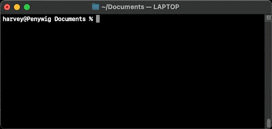

# oomerfarm

[ DO NOT USE IN PRODUCTION -- WORK IN PROGRESS ]
[ ALPHA release v0.2 , only for the technically curious]

### Simple bash scripts to deploy a personal renderfarm

>A renderfarm takes a workload, distributes it over a network and provides these benefits.
  1. Frees up desktop/laptop cpu
  2. Wedge testing simplified with queueing
  3. As needed **cloud computers** scale to:

        Reduce render time

        Reduce capital costs via hourly rentals

### run scripts ... render images  ###

1. Here is the actual time it takes to run the script on a Linux computer (**hub**) and set up the renderfarm manager and file server. 


2. Here I connect 2 network folders on my laptop and launch the **Deadline monitor**. 



3. Here I run bootstrap script on an Google t2d-standard-60 AMD Epyc 60 core instance for $0.47/hr, clone the instance a few times.

4. Returning to my laptop, the workers start appearing in **Deadline monitor** , I submit a 8 frame animation using the BellaRender plugin 

### The VPN makes these scenarios easy ###

1. In the home

    

2. Road warrior spinning up cloud rentals as needed

    

3. Combining home computers with hourly rentals

    

### Requirements ###

**Cloud rental or in-house server**<sup>hub</sup>
- 1 server with 1+ cores
- Alma/Rocky Linux 8.x 

**Cloud Rentals**<sup>workers</sup>
- 1+ server(s) with LOTSA<sup>TM</sup> cores
- Alma/Rocky Linux 8.x ( Ubuntu might work )

**Win/Mac/Linux**<sup>boss</sup>
- [ Deadline ]( https://awsthinkbox.com )
- [ git-bash ]( https://git-scm.com )<sup>win only</sup>

**Extra**
- Google account

---

 📘 To test drive for a few hours

1. **Warning** The oomerfarm test drive uses public VPN certificates. This allows somebody who can access this github AND who knows the public ip address of your hub to connect to your VPN. Test drive only if you understand this security hole. 

2. <sup>[hub]</sup> Rent AlmaLinux 8.x or get Linux on an old computer<sup>1 core is enough</sup>

```sh
dnf -y install git
git clone -b "v0.2" https://github.com/oomer/oomerfarm.git
cd oomerfarm 
bash bootstraphub.sh
```
3. <sup>[worker(s)]</sup> Rent 1+ servers with LOTSA<sup>TM</sup> cores

```sh
dnf -y install git
git clone -b "v0.2" https://github.com/oomer/oomerfarm.git
cd oomerfarm 
bash bootstrapworker.sh
```

4. <sup>[boss]</sup> on Desktop Linux/MacOS shell or [ git-bash ]( https://git-scm.com )<sup>Win</sup>
```sh
git clone "v0.2" https://github.com/oomer/oomerfarm.git
cd oomerfarm 
bash joinoomerfarm.sh
* On Windows run joinoomerfarm.bat as administrator
```
5. On desktop<sup>boss</sup>
    - Install [ Deadline ]( https://awsthinkbox.com )
    - Mount<sup>win/mac/linux</sup> DeadlineRepositry10<sup>share</sup> from 10.10.0.1 
    - Mount<sup>win/mac/linux</sup> oomerfarm<sup>share</sup> from 10.10.0.1
        - [user] ***oomerfarm***
        - [password] ***oomerfarm***
    - Start DeadlineMonitor
    - Select BellaRender 
        - pick orange-juice.bsz on oomerfarm<sup>share</sup>
        - pick output directory on oomerfarm<sup>share</sup>
        - submit job
        - monitor job
        - copy rendered images locally from oomerfarm<sup>share</sup>
6. Terminate any rented hubs + workers to avoid any further hourly charges. Done!

 📘 Steps for a long term personal renderfarm

1. On desktop<sup>boss</sup>

```sh
dnf -y install git
git clone -b "v0.2" https://github.com/oomer/oomerfarm.git
cd oomerfarm 
bash keyoomerfarm.sh
```

2. Open folder oomerfarm/_oomerkeys_ . Put ***hub.keybundle.enc*** and ***workers.keybundle.enc*** on Google Drive. Share using ***Anyone with link*** then click ***Copy Link***'. 

3. <sup>[aka hub]</sup> Rent AlmaLinux 8.x or get Linux on an old computer<sup>1 core is enough</sup>

```sh
dnf -y install git
git clone -b "v0.2" https://github.com/oomer/oomerfarm.git
cd oomerfarm 
bash bootstraphub.sh
* instead of "i_agree_this_is_unsafe" use "hub"
* Use your google drive url to hub.keybundle.enc
```
4. <sup>[aka worker(s)]</sup> Rent 1+ servers with LOTSA<sup>TM</sup> cores

```sh
dnf -y install git
git clone -b "v0.2" https://github.com/oomer/oomerfarm.git
cd oomerfarm 
bash bootstrapworker.sh
* Use your google drive url to worker.keybundle.enc
* Use unique name required per worker ie worker0001, worker0002 
```
5. Back to desktop<sup>mac/linux</sup>
```sh
bash joinoomerfarm.sh
* Leave shell open to maintain VPN
---
* On Windows run joinoomerfarm.bat as administrator
```
6. ***Finder:*** ( smb://10.10.0.1 )
***Explorer:*** ( \\\\10.10.0.1 )
 - mount shares ***DeadineRepository10*** and ***oomerfarm***
 - [user] ***oomerfarm***
 - [password] only you know
7. Drag a Bella scene file (***.bzx***) to 
    - //10.10.0.1/oomerfarm/bella <sup>windows</sup>
    - //Volumes/oomerfarm/bella <sup>mac</sup>
    - //mnt/oomerfarm/bella <sup>linux</sup>
8. Run [***Deadline Client***](https://awsthinkbox.com) installer on desktop<sup>win/mac/linux</sup>
9. Launch Deadline Monitor and submit job
10. Done!

## Tech breakdown:
-  a **hub** host running Alma/Rocky Linux 8.x, Samba, MongoDB and AWS Thinkbox's Deadline Repository in the cloud
- an enterprise grade built-in firewall overlay network https://github.com/slackhq/nebula ( open source with full certificate-authority infrastructure[ allowing you to skip third party CA's ] )
- Linux **worker** hosts for simultaneously rendering locally AND/OR in cloud. VPN IP address assignment is written to Nebula certs/keys by ***keyoomerfarm.sh***. Instead of a typical deploy new instance with a bespoke cert/key, ***oomerfarm*** adopts ***batch certification***, as I call it, meaning every worker stores ALL worker certs/keys and on boot dynamically chooses one. Thus any worker vm can be cloned via the cloud providers web panel or programmatically via cli tools.
- Because oomerfarm's bash scripts don't take very long to run, the network topology can be redefined by rerunning keyoomerfarm.sh and the new keybundles can be reuploaded to Google drive to seed the hub and a new batch of workers.
- certificate signing scripts generic enough to natively run on Linux and MacOS without additonal runtimes.
( Windows needs msys as in https://git-scm.com )

TODO:
- MongoDB security is over unsecure http but within secure VPN, should add openssl certs to secure against man-in-the-VPN-middle attacks
