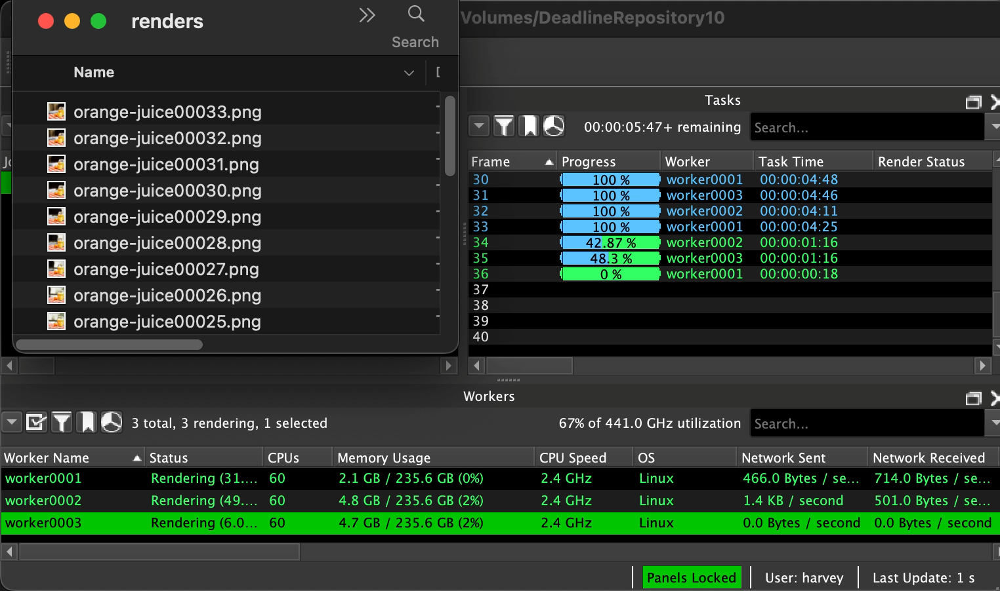
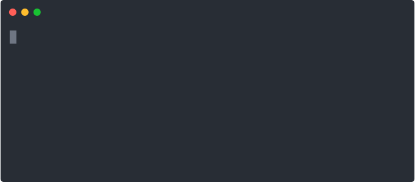

# oomerfarm: Simple bash scripts to deploy a personal renderfarm 

[ WORK IN PROGRESS ]
[ BETA release v0.5 ]

https://github.com/oomer/bellarenderfarm documents the installation steps to get a Deadline renderfarm working. After writing this I felt that this hours long process could be streamlined to a few minutes. 

    oomerfarm wrangles the deployment of the Deadline renderfarm "stack" down to around 20 minutes and overlays a virtual private network to simplify network scaling. This infrastructure is primarily aimed at the lone artist. 

## Renderfarm benefits 
A renderfarm takes a workload, distributes it over a network and provides: 
  1. freedom to continue working on your computer by dispatching cpu intensive workloads to the "farm"
  2. a GUI to track job submissions, success, progress and failures.
  3. Perform post-render operations like convert frames to video or merge co-operative renders. 

## oomerfarm benefits
- The network topology of the included VPN, allows working from home or the coffee shop.
- The same topology avoids lock-in to any particular cloud computer vendor allowing you to shop for the best hourly rates.
- A renderfarm is complicated and oomerfarm doesn't make it simpler but it does wraps up this complexity by boiling it down to 4 bash scripts

---
## Equipment 
- Computer A => **MacOS** or **Windows** or **Linux** computer
- Computer B => a Linux server on 24/7: 
    - Doesn't render, just runs file server and dispatches jobs
    - [RECOMMENDED] run a a cheap $20/year server like [these](https://get.crunchbits.com/order/lblk-yearly-kvm-ssd-vps/84)
    - OR run on a mini pc at home and port forward [42042] on your router 
- Computer C-Z => cpu or gpu heavy Linux machines: 
    - [RECOMMENDED] rent hourly computers like [these](https://cloud.vast.ai/)
    - OR Add your own computers 
---

## Run scripts

> Each bash script 

1. run ***becomesecure.sh*** on Computer A to begin the rollout of your VPN
2. run ***bootstraphub.sh*** on Computer B
    - ***Alma/Rocky 8.x Linux***

    - this becomes your centralized **Deadline renderfarm** hub with:
        - file server to save scenes and textures
        - render queue database
        - virtual private network

3. run ***bridgeoomerfarm.sh*** on Computer B to connect to the hub
    - a personal ***desktop/laptop***,  to connect to your private oomerfarm. Install Deadline client software https://awsthinkbox.com 
to get a GUI ti submit jobs.
3. Rent **cloud** computers and run ***bootstrapworker.sh*** on each to get the renderfarm churning. Here is a [timelapse](https://a4g4.c14.e2-1.dev/public/oomerfarm/Googlet2d-standard-60x3-timelapse.mp4) at 2x speed, spinning up 3 Google instances. In real time it took 5 minutes per instances. 

>These 3 steps create a working renderfarm but not When you are ready for a permanent oomerfarm, run ***becomesecure.sh*** on your desktop/laptop to create bespoke private keys to secure your castle.

## Summary

5. So there you go: 4 bash scripts, all starting with the letter ***b*** to empower your personal renderfarm.
    - becomesecure.sh
    - bootstraphub.sh
    - bootstrapworker.sh
    - bridgeoomerfarm.sh

---

## Step by step guides

[Guide for a test drive renderfarm](Documentation/TestDrive.md)

[Guide for a personal renderfarm](Documentation/BespokeRenderfarm.md)

[Deadline Manual](https://docs.thinkboxsoftware.com/products/deadline/10.3/1_User%20Manual/manual/overview.html)

[FAQ](Documentation/FAQ.md)