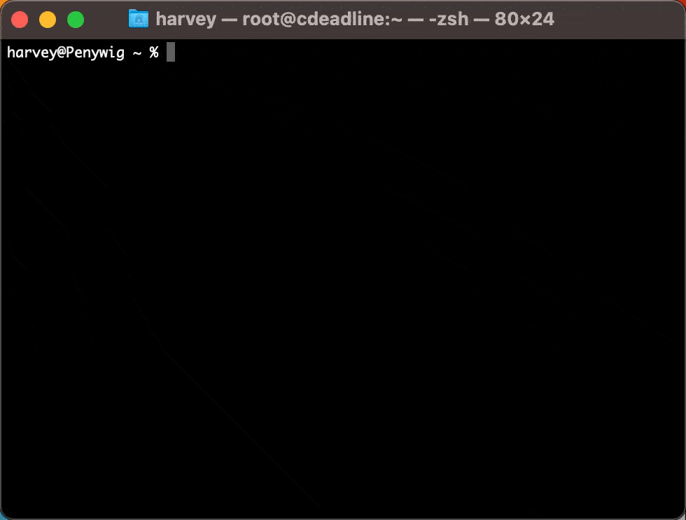

# oomerfarm

[ DO NOT USE IN PRODUCTION -- WORK IN PROGRESS ]
[ ALPHA release v0.1]
[ BellaRender plugin is especially janky ]
[ Linux desktop not tested yet , it may work ]
[ security model under review ]

### Disposable personal renderfarm
>Set up a renderfarm with rented cloud or in-house computers and security bundled in a VPN.

***Requirements:***

**Cloud**
- 1+ server(s) with LOTSA<sup>TM</sup> cores
- AlmaLinux 8.x 
- git
- Google account<sup>not needed for test drive</sup>

**Desktop**
- ssh, git 
- [ Deadline ]( https://awsthinkbox.com )
- [ git-bash ]( https://git-scm.com )<sup>win only</sup>

**Cloud or in-house server**
- 1 server with 1+ cores
- AlmaLinux 8.x 
- git



 📘 To test drive for a few hours

1. **Warning** The test drive uses VPN certificates that are in this code. This allows somebody who can access this github AND who knows the public ip address of your hub<sup>oomerfarm</sup> connect to the VPN<sup>oomerfarm</sup>. Use the test drive only if you understand this security hole. 

2. <sup>[aka hub]</sup> Rent AlmaLinux 8.x or get Linux on an old computer<sup>1 core is enough</sup>

```sh
dnf -y install git
git clone -b "v0.1" https://github.com/oomer/oomerfarm.git
cd oomerfarm 
bash bootstraphub.sh
```
3. <sup>[aka worker(s)]</sup> Rent 1+ servers with LOTSA<sup>TM</sup> cores

```sh
dnf -y install git
git clone -b "v0.1" https://github.com/oomer/oomerfarm.git
cd oomerfarm 
bash bootstrapworker.sh
```

4. <sup>[aka boss]</sup> on Desktop Linux/MacOS shell or [ git-bash ]( https://git-scm.com )
```sh
git clone "v0.1" https://github.com/oomer/oomerfarm.git
cd oomerfarm 
bash joinoomerfarm.sh
* On Windows run joinoomerfarm.bat as administrator
```
5. On desktop<sup>boss</sup>
    - Install [ Deadline ]( https://awsthinkbox.com )
    - Mount<sup>win/mac/linux</sup> DeadlineRepositry10<sup>share</sup> from 10.10.0.1 
    - Mount<sup>win/mac/linux</sup> oomerfarm<sup>share</sup> from 10.10.0.1
        - [user] ***oomerfarm***
        - [password] ***oomerfarm***
    - Start DeadlineMonitor
    - Select BellaRender 
        - pick orange-juice.bsz on oomerfarm<sup>share</sup>
        - pick output directory on oomerfarm<sup>share</sup>
        - submit job
        - monitor job
        - copy rendered images locally from oomerfarm<sup>share</sup>
6. Terminate any rented hubs + workers to avoid any further hourly charges. Done!

 📘 Steps for a long term personal renderfarm

1. On desktop<sup>boss</sup>

```sh
dnf -y install git
git clone -b "v0.1" https://github.com/oomer/oomerfarm.git
cd oomerfarm 
bash keyoomerfarm.sh
```

2. Open folder oomerfarm/_oomerkeys_ . Put ***hub.keybundle.enc*** and ***workers.keybundle.enc*** on Google Drive. Share using ***Anyone with link*** then click ***Copy Link***'. 

3. <sup>[aka hub]</sup> Rent AlmaLinux 8.x or get Linux on an old computer<sup>1 core is enough</sup>

```sh
dnf -y install git
git clone -b "v0.1" https://github.com/oomer/oomerfarm.git
cd oomerfarm 
bash bootstraphub.sh
* instead of "i_agree_this_is_unsafe" use "hub"
* Use your google drive url to hub.keybundle.enc
```
4. <sup>[aka worker(s)]</sup> Rent 1+ servers with LOTSA<sup>TM</sup> cores

```sh
dnf -y install git
git clone -b "v0.1" https://github.com/oomer/oomerfarm.git
cd oomerfarm 
bash bootstrapworker.sh
* Use your google drive url to worker.keybundle.enc
```
5. On desktop<sup>win/mac/linux</sup>
```sh
bash joinoomerfarm.sh
* Leave shell open to maintain VPN
```
6. ***Finder:*** ( smb://10.10.0.1 )
***Explorer:*** ( \\\\10.10.0.1 )
 - mount shares ***DeadineRepository10*** and ***Bella***
 - [user] ***oomerfarm***
 - [password] only you know
7. Drag a Bella scene file (***.bzx***) to 
    - //10.10.0.1/oomerfarm/bella <sup>windows</sup>
    - //Volumes/oomerfarm/bella <sup>mac</sup>
    - //mnt/oomerfarm/bella <sup>linux</sup>
8. Run [***Deadline Client***](https://awsthinkbox.com) installer on desktop<sup>win/mac/linux</sup>
9. Launch Deadline Monitor and submit job
10. Done!

## Tech breakdown:
-  a **hub** host running Alma/Rocky Linux 8.x, Samba, MongoDB and AWS Thinkbox's Deadline Repository in the cloud
- an enterprise grade built-in firewall overlay network https://github.com/slackhq/nebula ( open source with full certificate-authority infrastructure[ allowing you to skip third party CA's ] )
- Linux **worker** hosts for simultaneously rendering locally AND/OR in cloud. VPN IP address assignment is written to Nebula certs/keys by ***keyoomerfarm.sh***. Instead of a typical deploy new instance with a bespoke cert/key, ***oomerfarm*** adopts ***batch certification***, as I call it, meaning every worker stores ALL worker certs/keys and on boot dynamically chooses one. Thus any worker vm can be cloned via the cloud providers web panel or programmatically via cli tools.
- Because oomerfarm's bash scripts don't take very long to run, the network topology can be redefined by rerunning keyoomerfarm.sh and the new keybundles can be reuploaded to Google drive to seed the hub and a new batch of workers.
- Win/Mac/Linux **boss** hosts for submitting jobs
- certificate signing scripts generic enough to natively run on Linux and MacOS without additonal runtimes.
( Windows needs msys as in https://git-scm.com )

#### Navigate the complex render manager interdependencies between networking, database server, certificate-signing, secrets management and file sharing


TODO:
- MongoDB security is over unsecure http but within secure VPN, should add openssl certs to secure against man-in-the-VPN-middle attacks
