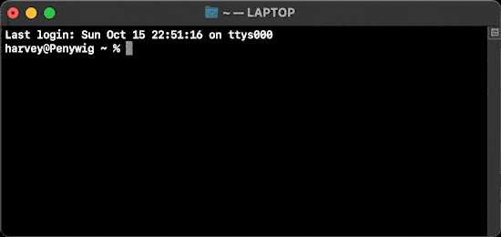

# oomerfarm

[ DO NOT USE IN PRODUCTION -- WORK IN PROGRESS ]
[ ALPHA release v0.2 , only for the technically curious]

### Simple bash scripts to deploy a personal renderfarm

>A renderfarm takes a workload, distributes it over a network and provides these benefits.
  1. Frees up desktop/laptop cpu
  2. Wedge testing simplified with queueing
  3. As needed cloud computers scale to:

        Reduce render time

        Reduce capital costs via hourly rentals

Oomerfarm deploys in 3 ways

1. In the home

    

2. Full road warrior in the cloud

    

3. Combine home computers with hourly rentals

    

In all cases you need:

1. A central job dispatcher called the hub ( aka renderfarm manager ) and file server. 

2. one+ worker(s) asking for work and getting scenes from the hub.

3. one boss ( green dude ) sending jobs and downloading rendered images from the hub.


>A renderfarm manager ( ie AWSThinkbox's Deadline ) marshalls job submissions, monitoring, errors, license tracking, job priorities, time sharing with others and a whole host of other value added features. 

Even before launching a render managers, there is a complex weave of networking, security and dependencies that need fulfilling before the farm **just works**. Oomerfarm TRYS to wrangle these threads of complexity so that even AWS Thinkbox's Deadline ( typically used in large studios )becomes useful for a single artist with 2-10 render workers.

[ Initially AWS Thinkbox Deadline will be the render manager but Sony's open source OpenCue could be an option in the future.]


### FAQ
How are final rendered images retrieved?
- connect to oomerfarm VPN
-  mount **//10.10.0.1/oomerfarm/renders**  (win)
-  or **smb://10.10.0.1/oomerfarm/renders** network  folder (**smb/cifs**) using drag&drop in Explorer/Finder 

>Is oomerfarm useful for a lone artist?
- Yes, renting cloud computers by the hour is less capital cost intensive than buying another computer just to do renders. I am currently tracking a benchmark scene that renders for $0.04/frame using a rented cloud computer and $0.005-$0.01/frame in electrical costs using on-premise hardware based on similar cpu resources.  Renderfarm queues are also a better way to keep track of rendering different looks.

>Is oomerfarm useful for a team of artists?
- Yes, within the oomerfarm VPN, all artists can submit jobs to the renderfarm to share resources across multiple locations including multiple on-premise workers. 

>Can I use oomerfarm without the cloud?
- Yes, grab a bunch of brand new Threadrippers or 10 year old Xeon's along with a single ebay computer acting as a hub, install Linux on all of them and plug in the ethernet cables and run the oomerfarm bash scripts.

>Can I use oomerfarm on the road with a laptop and cloud render workers?
- Yes, the VPN works anywhere you have internet access to connect fully to all parts of your renderfarm. I use it daily in my car.

>Can I use a mix of computers I own and the cloud and a laptop?
- Yes, blend existing hardware and add a rental computer with the oomerfarm scripts in less than 5 minutes. Shut down rentals after your

> Can I use Windows or MacOS computers as the hub or as workers?
- No, while Deadline supports running on Windows , MacOS and Linux, oomerfarm limits  **workers** and **hub** to running Linux because it is already insanely complex.

### Requirements ###

**Cloud**<sup>worker(s)</sup>
- 1+ server(s) with LOTSA<sup>TM</sup> cores
- AlmaLinux 8.x 
- git
- Google account<sup>not needed for test drive</sup>

**Desktop Win/Mac/Linux**<sup>boss</sup>
- ssh, git 
- [ Deadline ]( https://awsthinkbox.com )
- [ git-bash ]( https://git-scm.com )<sup>win only</sup>

**Cloud or in-house server**<sup>hub</sup>
- 1 server with 1+ cores
- AlmaLinux 8.x 
- git

---



 📘 To test drive for a few hours

1. **Warning** The oomerfarm test drive uses VPN certificates that are in this code. This allows somebody who can access this github AND who knows the public ip address of your hub to connect to your VPN. Test drive only if you understand this security hole. 

2. <sup>[hub]</sup> Rent AlmaLinux 8.x or get Linux on an old computer<sup>1 core is enough</sup>

```sh
dnf -y install git
git clone -b "v0.2" https://github.com/oomer/oomerfarm.git
cd oomerfarm 
bash bootstraphub.sh
```
3. <sup>[worker(s)]</sup> Rent 1+ servers with LOTSA<sup>TM</sup> cores

```sh
dnf -y install git
git clone -b "v0.2" https://github.com/oomer/oomerfarm.git
cd oomerfarm 
bash bootstrapworker.sh
```

4. <sup>[boss]</sup> on Desktop Linux/MacOS shell or [ git-bash ]( https://git-scm.com )<sup>Win</sup>
```sh
git clone "v0.2" https://github.com/oomer/oomerfarm.git
cd oomerfarm 
bash joinoomerfarm.sh
* On Windows run joinoomerfarm.bat as administrator
```
5. On desktop<sup>boss</sup>
    - Install [ Deadline ]( https://awsthinkbox.com )
    - Mount<sup>win/mac/linux</sup> DeadlineRepositry10<sup>share</sup> from 10.10.0.1 
    - Mount<sup>win/mac/linux</sup> oomerfarm<sup>share</sup> from 10.10.0.1
        - [user] ***oomerfarm***
        - [password] ***oomerfarm***
    - Start DeadlineMonitor
    - Select BellaRender 
        - pick orange-juice.bsz on oomerfarm<sup>share</sup>
        - pick output directory on oomerfarm<sup>share</sup>
        - submit job
        - monitor job
        - copy rendered images locally from oomerfarm<sup>share</sup>
6. Terminate any rented hubs + workers to avoid any further hourly charges. Done!

 📘 Steps for a long term personal renderfarm

1. On desktop<sup>boss</sup>

```sh
dnf -y install git
git clone -b "v0.2" https://github.com/oomer/oomerfarm.git
cd oomerfarm 
bash keyoomerfarm.sh
```

2. Open folder oomerfarm/_oomerkeys_ . Put ***hub.keybundle.enc*** and ***workers.keybundle.enc*** on Google Drive. Share using ***Anyone with link*** then click ***Copy Link***'. 

3. <sup>[aka hub]</sup> Rent AlmaLinux 8.x or get Linux on an old computer<sup>1 core is enough</sup>

```sh
dnf -y install git
git clone -b "v0.2" https://github.com/oomer/oomerfarm.git
cd oomerfarm 
bash bootstraphub.sh
* instead of "i_agree_this_is_unsafe" use "hub"
* Use your google drive url to hub.keybundle.enc
```
4. <sup>[aka worker(s)]</sup> Rent 1+ servers with LOTSA<sup>TM</sup> cores

```sh
dnf -y install git
git clone -b "v0.2" https://github.com/oomer/oomerfarm.git
cd oomerfarm 
bash bootstrapworker.sh
* Use your google drive url to worker.keybundle.enc
* Use unique name required per worker ie worker0001, worker0002 
```
5. Back to desktop<sup>mac/linux</sup>
```sh
bash joinoomerfarm.sh
* Leave shell open to maintain VPN
---
* On Windows run joinoomerfarm.bat as administrator
```
6. ***Finder:*** ( smb://10.10.0.1 )
***Explorer:*** ( \\\\10.10.0.1 )
 - mount shares ***DeadineRepository10*** and ***oomerfarm***
 - [user] ***oomerfarm***
 - [password] only you know
7. Drag a Bella scene file (***.bzx***) to 
    - //10.10.0.1/oomerfarm/bella <sup>windows</sup>
    - //Volumes/oomerfarm/bella <sup>mac</sup>
    - //mnt/oomerfarm/bella <sup>linux</sup>
8. Run [***Deadline Client***](https://awsthinkbox.com) installer on desktop<sup>win/mac/linux</sup>
9. Launch Deadline Monitor and submit job
10. Done!

## Tech breakdown:
-  a **hub** host running Alma/Rocky Linux 8.x, Samba, MongoDB and AWS Thinkbox's Deadline Repository in the cloud
- an enterprise grade built-in firewall overlay network https://github.com/slackhq/nebula ( open source with full certificate-authority infrastructure[ allowing you to skip third party CA's ] )
- Linux **worker** hosts for simultaneously rendering locally AND/OR in cloud. VPN IP address assignment is written to Nebula certs/keys by ***keyoomerfarm.sh***. Instead of a typical deploy new instance with a bespoke cert/key, ***oomerfarm*** adopts ***batch certification***, as I call it, meaning every worker stores ALL worker certs/keys and on boot dynamically chooses one. Thus any worker vm can be cloned via the cloud providers web panel or programmatically via cli tools.
- Because oomerfarm's bash scripts don't take very long to run, the network topology can be redefined by rerunning keyoomerfarm.sh and the new keybundles can be reuploaded to Google drive to seed the hub and a new batch of workers.
- Win/Mac/Linux **boss** hosts for submitting jobs
- certificate signing scripts generic enough to natively run on Linux and MacOS without additonal runtimes.
( Windows needs msys as in https://git-scm.com )

#### Navigate the complex render manager interdependencies between networking, database server, certificate-signing, secrets management and file sharing


TODO:
- MongoDB security is over unsecure http but within secure VPN, should add openssl certs to secure against man-in-the-VPN-middle attacks
